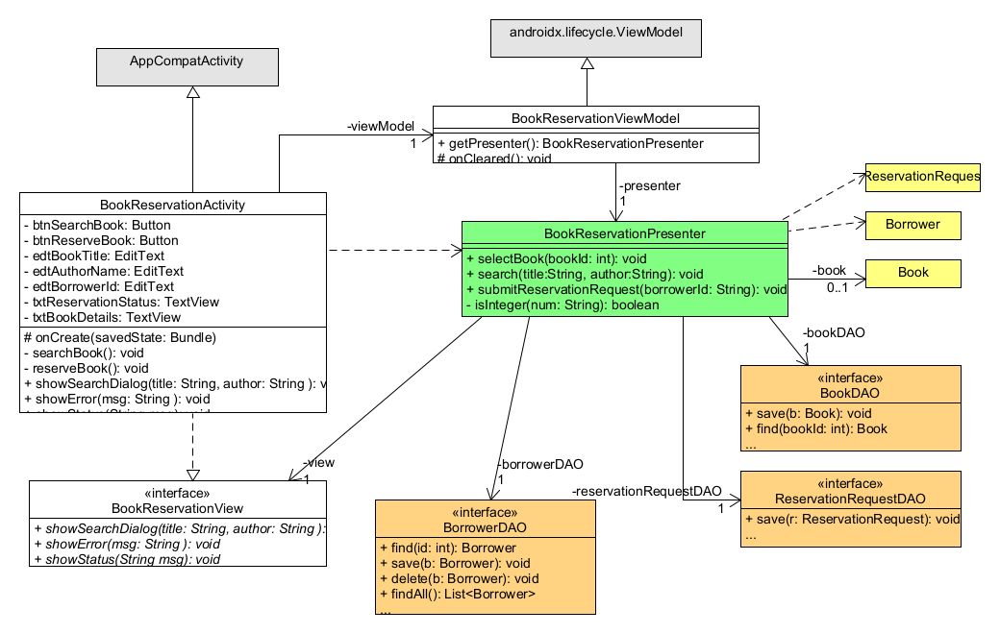
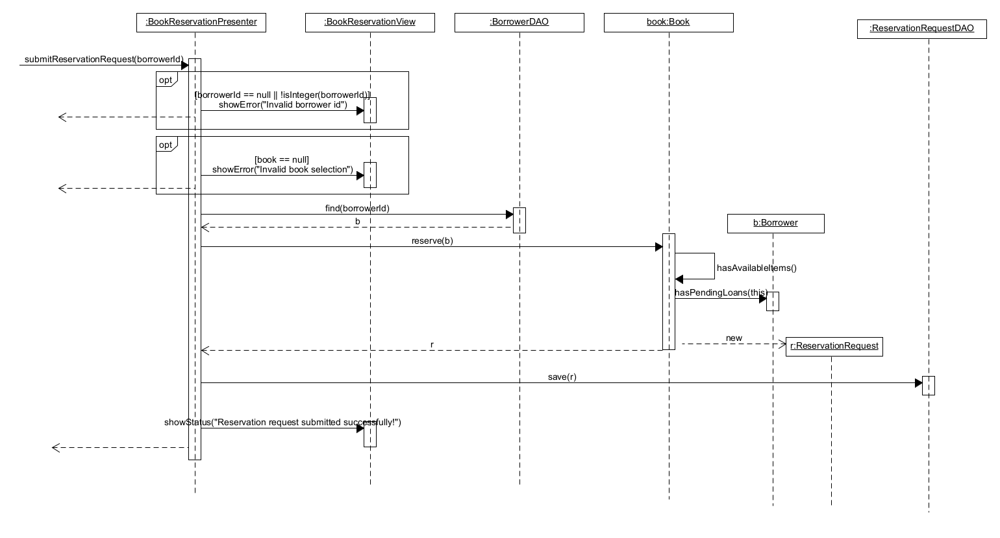

# Σχεδίαση της ΠΧ Αίτημα Κράτησης Βιβλίου

## Διάγραμμα κλάσεων

Οι κλάσεις που συμμετέχουν στην υλοποίηση της ΠΧ φαίνονται στο παρακάτω διάγραμμα:

Οι μέθοδοι και ιδιότητες των Domain κλάσεων δεν φαίνονται για λόγους απλούστευσης του διαγράμματος.
Η σχεδίαση του Domain model έχει ήδη παρουσιαστεί στα πλαίσια άλλου διαγράμματος κλάσεων.

## Διαδικασία αιτήματος κράτησης

Η λογική της διαδικασίας υποβολής αιτήματος κράτησης περιλαμβάνεται κυρίως στην μέθοδο `submitReservationRequest()` 
της κλάσης `BookReservationPresenter`. 
Η αλληλεπίδραση βασικών κλάσεων του συστήματος στα πλαίσια της παραπάνω μεθόδου φαίνεται 
στο παρακάτω διάγραμμα ακολουθίας:

Στα διάγραμμα δίνεται έμφαση στην αλληλεπίδραση μεταξύ των κλάσεων της εφαρμογής
για την περίπτωση όπου ο δανειζόμενος έχει δικαίωμα υποβολής
αιτήματος κράτησης.