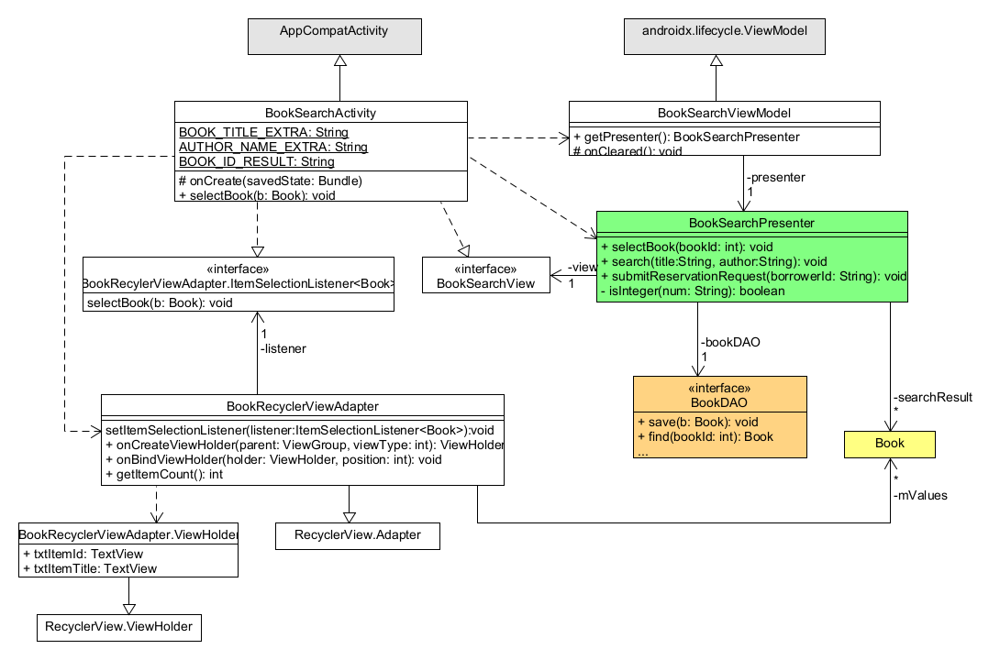
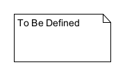

# Σχεδίαση της ΠΧ Αναζήτηση Βιβλίου

## Διάγραμμα κλάσεων

Οι κλάσεις που συμμετέχουν στην υλοποίηση της ΠΧ φαίνονται στο παρακάτω διάγραμμα:

Οι μέθοδοι και ιδιότητες των Domain κλάσεων δεν φαίνονται για λόγους απλούστευσης του διαγράμματος.
Η σχεδίαση του Domain model έχει ήδη παρουσιαστεί στα πλαίσια άλλου διαγράμματος κλάσεων.

## Διαδικασία αναζήτησης βιβλίου

Η λογική της διαδικασίας αναζήτησης βιβλίου περιλαμβάνεται κυρίως στην μέθοδο `search()` 
της κλάσης `BookSearchPresenter`. 
Η αλληλεπίδραση βασικών κλάσεων του συστήματος στα πλαίσια της παραπάνω μεθόδου φαίνεται 
στο παρακάτω διάγραμμα ακολουθίας:

