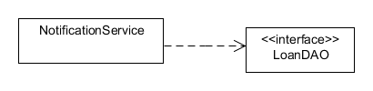
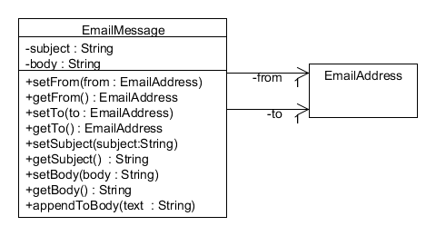
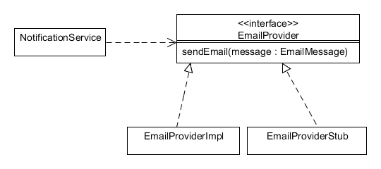

# Τροποποιήσεις στη σχεδίαση

Ο τελικός κώδικας του δανεισμού των βιβλίων έχει κάποιες αλλαγές σε σχέση με όσα είδαμε στο βιβλίο. Οι αλλαγές αυτές προκύπτουν ως βελτιώσεις οι οποίες λόγω του περιορισμένου χώρου δεν εξετάστηκαν με λεπτομέρεια. Οι παρακάτω ενότητες περιγράφουν τις αλλαγές αυτές όπως και το σκεπτικό τους.

## Η κλάση SystemDate

Στο λογισμικό της βιβλιοθήκης θα χρησιμοποιήσουμε την ημερομηνία του συστήματος για να καταγράφουμε τις ημερομηνίες του δανεισμού και της επιστροφής αντιτύπων. Η κλάση `LocalDate.now` κάνει ακριβώς αυτό. Μας δίνει την  ημερομηνία και ώρα του συστήματος. Η χρήση της ημερομηνίας και ώρας του συστήματος γίνεται προβληματική όταν θέλουμε να εκτελέσουμε αυτόματους ελέγχους για τις περιπτώσεις χρήσης του δανεισμού και της επιστροφής αντιτύπου. Το ημερολόγιο του συστήματος μας δυσκολεύει γιατί προφανώς δεν έχει προβλέψιμη συμπεριφορά. Θα θέλαμε ως δεδομένο εισόδου κάποιου δανεισμού να περάσουμε μία προκαθορισμένη ημερομηνία και όχι την ημερομηνία που εκτελείται ο έλεγχος. Το συγκεκριμένο θέμα το αναπτύξαμε στην ενότητα 14.3.2 του βιβλίου με τις ισοτιμίες των νομισμάτων. Σε εκείνο το παράδειγμα δημιουργήσαμε μία διεπαφή της Java για το αντικείμενο που δεν είχε προβλέψιμη συμπεριφορά και το υποκαταστήσαμε με κάποιο στέλεχος (stub).

Στο συγκεκριμένο πρόβλημα ακολουθούμε μία διαφορετική λύση. Καταρχήν δημιουργούμε μία κλάση `SystemDate` με τη στατική μέθοδο `now` η οποία επιστρέφει την ημερομηνία και ώρα του συστήματος. Έτσι όποτε ζητείται η ημερομηνία και ώρα του συστήματος από τον υπόλοιπο κώδικα καλείται αυτή η στατική μέθοδος. Εκτός όμως από την απ' ευθείας επιστροφή της ημερομηνίας του συστήματος δίνουμε και τη δυνατότητα υποκατάστασης της ημερομηνίας με κάποιο στέλεχος. Αυτό γίνεται με τη στατική μέθοδο `setStub` με προστατευμένη ορατότητα. Με αυτό τον τρόπο μία κλάση ελέγχου η οποία τοποθετείται εντός του ίδιου πακέτου με τη `SystemDate` μπορεί να θέσει το στέλεχος. Η μέθοδος `now` εξετάζει πρώτα αν υπάρχει το στέλεχος και αν ναι το επιστρέφει αλλιώς επιστρέφει την ημερομηνία του συστήματος. Ας δούμε τον κώδικα της κλάσης `SystemDate`.

    public class SystemDate {
        protected SystemDate() { }
        private static LocalDate stub;
        protected static void setStub(LocalDate stubDate) {
            stub = stubDate;
        }
        public static SimpleCalendar now() {
             return stub == null ? LocalDate.now() : stub;
        }
    }

Έχοντας δημιουργήσει την κλάση, το μόνο που απομένει είναι να καλούμε πάντα τη μέθοδο `now` για να λάβουμε είτε την πραγματική ημερομηνία του συστήματος, είτε κάποιο στέλεχος. Με αυτό τον τρόπο έχουμε πλέον πλήρη έλεγχο στην ημερομηνία που επιστρέφει το ημερολόγιο του συστήματος για τους αυτόματους ελέγχους που θέλουμε να εκτελέσουμε.

Για παράδειγμα ο κώδικας για τη μέθοδο `borrow` της κλάσης `Item` γίνεται

    public Loan borrow(Borrower borrower) {
            .......
            Loan loan = new Loan();
            loan.setItem(this);
            loan.setBorrower(borrower);
            loan.setLoanDate(SystemDate.now());
            return loan;
        }

Αν τώρα θέλουμε να εκτελέσουμε κάποιο έλεγχο στη μέθοδο `borrow` και θέλουμε να ορίσουμε μία συγκεκριμένη ημερομηνία έστω την 1/3/2007 ως ημερομηνία του συστήματος τότε ο κώδικας ελέγχου γίνεται:

    @Test
        public void testBorrow() {
            SystemDateStub.setStub( LocalDate.of(2007,3,1));
            Borrower borrower = new Borrower();
            Item item = new Item();
            ......
            Loan loan = item.borrow(borrower);
            .....
        }

Θα πρέπει όμως να είμαστε ιδιαίτερα προσεκτικοί καθώς  η ημερομηνία αποθηκεύεται σε στατικό πεδίο της κλάση `SystemDate` και συνεπώς βάζουμε σε κίνδυνο την ανεξαρτησία των ελέγχων. Μετά την εκτέλεση του ελέγχου θα πρέπει να επαναφέρουμε την κλάση `SystemDate` στο να επιστρέφει την πραγματική ημερομηνία του συστήματος. Αυτό το επιτυγχάνουμε στον έλεγχο της κλάσης `Item` με μία μέθοδο με την επισημείωση <code>@AfterEach</code> η οποία επαναφέρει την ημερομηνία του συστήματος.

## Η κλάση Item

Αντικείμενα της κλάσης `Item` αλλάζουν κατάσταση ανάλογα με τις ενέργειες που γίνονται σε κάθε αντίτυπο (δανεισμός, επιστροφή κλπ). Μία από τις εκκρεμότητες του βιβλίου είναι και η σχεδίαση της κλάσης `Item` έτσι ώστε να ανταποκρίνεται στο παράδειγμα 4-5. Στο συγκεκριμένο παράδειγμα καταγράψαμε τις δυνατές καταστάσεις ενός αντικειμένου της κλάσης `Item` και μοντελοποιήσαμε τις δυνατές μεταβάσεις από μία κατάσταση σε κάποια άλλη. Ο τρόπος της σχεδίασης της κλάσης ο οποίος ανταποκρίνεται στις μεταβάσεις μεταξύ των καταστάσεων είναι σχετικά απλός. Πρώτα από όλα ορίζουμε την απαρίθμηση `ItemState` σύμφωνα με το παρακάτω σχήμα. Η κατάσταση ενός αντικειμένου της κλάσης `Item` δηλώνεται με μία ιδιότητα τύπου `ItemState`.

Η κατάσταση ενός αντιτύπου θα είναι διαθέσιμη με τη μέθοδο `getState`. Η αλλαγή όμως των καταστάσεων ενθυλακώνεται πίσω από μεθόδους της κλάσης `Item`. Αντί λοιπόν να αλλάζουμε την κατάσταση των αντικειμένων (πιθανά με κάποια μέθοδο `setState`) στέλνουμε μηνύματα στα αντικείμενα της κλάσης `Item`. Στην κατάσταση `NEW` περνάει ένα αντικείμενο με τη δημιουργία του. Στην κατάσταση `LOANED` περνάει με τη μέθοδο `borrow` (βλέπε παράδειγμα 8-8 του βιβλίου). Άρα θα πρέπει να ορίσουμε τις μεθόδους `available, withdraw,` και `lost` για να συμπληρώσουμε όλα τα μηνύματα που μπορούμε να στείλουμε σε ένα αντικείμενο της `Item`. Η λογική των μεθόδων υλοποιεί τις επιτρεπτές καταστάσεις μεταξύ των διαφορετικών καταστάσεων.

Έτσι αν ένα αντίτυπο είναι στην κατάσταση `LOST` και στείλουμε το μήνυμα `borrow` τότε θα πρέπει να λάβουμε μία εξαίρεση. Σε πιο πολύπλοκες περιπτώσεις όπου η συμπεριφορά ενός αντικειμένου βασίζεται στην κατάστασή του ίσως να επιλέγαμε και το πρότυπο σχεδίασης “κατάσταση” (state design pattern). Η τελική διαμόρφωση της κλάσης `Item` παρουσιάζεται στο παρακάτω σχήμα.

# Ενημέρωση για καθυστέρηση

Η περίπτωση χρήσης “ενημέρωση για καθυστέρηση” περιγράφει ότι θα πρέπει να ενημερώνονται όλοι οι δανειζόμενοι οι οποίοι έχουν καθυστερήσει την επιστροφή κάποιου αντιτύπου. Η περίπτωση χρήσης “ενημέρωση για καθυστέρηση” περιγράφηκε στο παράδειγμα 3.8 του βιβλίου. Δεν ασχοληθήκαμε όμως με τη συγκεκριμένη περίπτωση χρήσης στη φάση της σχεδίασης. Η σχεδίαση της λύσης γι' αυτή την περίπτωση χρήσης έχει κάποιο ενδιαφέρον. Και περισσότερο ενδιαφέρον έχει ο τρόπος σκέψης για να φθάσουμε σε κάποια λύση. Αν σκεφτούμε τις διαφορετικές επιλογές μας για τη συγκεκριμένη περίπτωση χρήσης θα δούμε ότι υπάρχουν αρκετές επιλογές σχεδίασης ακόμα και για μία σχετικά απλή απαίτηση του λογισμικού. 

Δύο είναι τα βασικά χαρακτηριστικά της περίπτωσης χρήσης:

1. Δεν εντάσσεται στο υπόλοιπο λογισμικό μέσω της διεπαφής χρήστη αλλά ενεργοποιείται από το χρόνο. 
2. Αποστέλλει μηνύματα ηλεκτρονικού ταχυδρομείου και επικοινωνεί με ένα εξωτερικό υποσύστημα που είναι ο διακομιστής ηλεκτρονικού ταχυδρομείου. Ευτυχώς για τη Java έχουμε το [JavaMail API](https://javaee.github.io/javamail/) με το οποίο μπορούμε να συνθέσουμε και να αποστείλουμε μηνύματα ηλεκτρονικού ταχυδρομείου.

Το πρώτο το χαρακτηριστικό θα το αγνοήσουμε. Θα σχεδιάσουμε το λογισμικό αγνοώντας το γεγονός ενεργοποιείται από το χρόνο. Θα ασχοληθούμε με το δεύτερο χαρακτηριστικό που είναι η επικοινωνία με κάποιο εξωτερικό υποσύστημα και τα θέματα που θα μας απασχολήσουν είναι η ελεγξιμότητα και η επεκτασιμότητα. Το JavaMail API μας παρέχει μία σημαντική διευκόλυνση αλλά το πρόβλημα της σχεδίασης δεν εξαντλείται βέβαια στη χρήση του API.

Η βασική κλάση που θα υλοποιήσει την ενημέρωση για καθυστέρηση είναι η κλάση `NotificationService`. Όπως μας λέει και το όνομά της είναι μία κλάση που θα τοποθετηθεί στο πακέτο `service`. Ας ξεκινήσουμε τη σχεδίαση από τα βασικά ζητούμενα της περίπτωσης χρήσης. Το πρώτο ζητούμενο είναι η αναζήτηση από τη βάση δεδομένων των δανεισμών για τους οποίους έχει καθυστερήσει η επιστροφή των αντιτύπων. Το δεύτερο ζητούμενο είναι η σύνθεση και η αποστολή των μηνυμάτων ηλεκτρονικού ταχυδρομείου. Θα εξετάσουμε τα δύο ζητούμενα ξεχωριστά.

Η πρώτη επιλογή είναι να ζητήσουμε όλα τα αντικείμενα των δανεισμών και να ρωτήσουμε το αντικείμενο της κλάσης `Loan` αν δεν έχει γίνει η επιστροφή του αντιτύπου και αν έχει παρέλθει η ημερομηνία επιστροφής. Ένα υπόδειγμα κώδικα είναι το παρακάτω:

        List<Loan> allLoans = loanDao.findAll();
        for(Loan loan : allLoans) {         
            if (loan.isPending() &amp;&amp; loan.isOverdue()) {
                // .....
            }
        }

Το πρόβλημα με αυτή την επιλογή σχεδίασης είναι η απόδοση. Θα πρέπει να βρούμε όλους τους δανεισμούς που έχουν πραγματοποιηθεί μόνο για να βρούμε ένα μικρό υποσύνολο δανεισμών. Στο άλλο άκρο το αντικείμενο DAO επιστρέφει μόνο το υποσύνολο που μας ενδιαφέρει δηλαδή μόνο τους δανεισμούς για τους οποίους έχει παρέλθει η προθεσμία επιστροφής. Το υπόδειγμα του κώδικα είναι το παρακάτω:

        List<Loan> allLoans = loanDao.findOverdue();
        for(Loan loan : allLoans) {         
            // .....
        }

Μπορούμε να δούμε ότι η μέθοδος `findOverdue` αποφασίζει για το ποια αντικείμενα δανεισμών είναι αυτά για τα οποία έχει παρέλθει η ημερομηνία επιστροφής. Το πρόβλημα με αυτή την επιλογή σχεδίασης είναι ότι η απόφαση μετατίθεται στην ίδια τη βάση δεδομένων. Αντίθετα την απόφαση αυτή (δηλαδή για το αν έχει παρέλθει η προθεσμία επιστροφής) τη σχεδιάσαμε να ανήκει στη λογική του πεδίου των κλάσεων δηλαδή του λογισμικού (βλέπε παράδειγμα 12-5 του βιβλίου) και όχι στη βάση δεδομένων. Η επιλογή αυτή έχει προφανώς πάρα πολλά πλεονεκτήματα όσον αφορά στις δυνατότητες που έχουμε να αλλάξουμε τη λογική υπολογισμού των προθεσμιών επιστροφής των αντιτύπων.

Η τελική σχεδίαση που θα προκρίνουμε είναι κάπου στη μέση. Η βάση δεδομένων θα μας δώσει όλους τους δανεισμούς που εκκρεμούν. Η απόφαση για το αν έχει παρέλθει η προθεσμία επιστροφής θα ανήκει στη λογική του πεδίου δηλαδή στην κλάση `Loan`. Το υπόδειγμα του κώδικα είναι:

        List<Loan> allLoans = loanDao.findAllPending();     
        for(Loan loan : allLoans) {
            if (loan.isOverdue()) {             
                // ....
            }
        }

Η απόφαση για το αν ένας δανεισμός εκκρεμεί είναι σχετικά εύκολη για να το αναθέσουμε στη βάση δεδομένων. Ένας δανεισμός εκκρεμεί όταν η ημερομηνία επιστροφής δεν έχει οριστεί. Βασιζόμενο σε αυτό το κριτήριο το οποίο δεν φαίνεται να αλλάξει (είναι σταθερό) η βάση δεδομένων θα μας δώσει γρήγορα τις εγγραφές αυτές που ζητάμε. Η απόφαση που λαμβάνουμε δεν είναι αναγκαστικά και η τελική. Θα πρέπει να εκτελέσουμε και τους κατάλληλους ελέγχους χρονισμού (βλ. ενότητα 15.1.3 του βιβλίου) σε ρεαλιστικό περιβάλλον προκειμένου να επιβεβαιώσουμε τις αποφάσεις μας. Για εκτενέστερη εξέταση της σχέσης μεταξύ λογικής του πεδίου και βάσης δεδομένων βλέπε [εδώ](http://martinfowler.com/articles/dblogic.html.¨)

## Αποστολή μηνυμάτων ηλεκτρονικού ταχυδρομείου

Θυμίζουμε ότι ο στόχος μας είναι να αποστείλουμε μηνύματα ηλεκτρονικού ταχυδρομείου σε όσους δεν έχουν επιστρέψει τα αντίτυπα που έχουν δανειστεί και βέβαια έχει παρέλθει η προθεσμία επιστροφής. Στην προηγούμενη ενότητα ασχοληθήκαμε με το πρώτο σκέλος του προβλήματος που ήταν ο εντοπισμός των δανεισμών αυτών. Το δεύτερο σκέλος του προβλήματος είναι επίσης σημαντικό.

Έχουμε το ερώτημα της ανάθεσης σε κάποια κλάση της αποστολής μηνυμάτων ηλεκτρονικού ταχυδρομείου στον δανειζόμενο όταν αυτός αργήσει την επιστροφή ενός αντιτύπου. Θα αναθέσουμε την αρμοδιότητα αυτή στην κλάση `NotificationService`. Για την υλοποίηση της αποστολής των μηνυμάτων μπορούμε να χρησιμοποιήσουμε το JavaMail API.  Έχουμε όμως ένα βασικό πρόβλημα και αυτό είναι η υψηλή σύζευξη της κλάσης `NotificationService` με ένα εξωτερικό υποσύστημα που είναι το υποσύστημα του ηλεκτρονικού ταχυδρομείου. Η σύζευξη κάνει τον έλεγχο της κλάσης `NotificationService` εξαιρετικά δύσκολο. Θέλουμε να κωδικοποιήσουμε και να εκτελέσουμε αυτόματους ελέγχους με το JUnit στην υπηρεσία αποστολής μηνυμάτων. Προφανώς δεν μπορούμε στα πλαίσια των αυτόματων ελέγχων να στέλνουμε πραγματικά e-mails σε πραγματικές διευθύνσεις ηλεκτρονικού ταχυδρομείου. Οι έλεγχοι μας δεν θα έχουν τα χαρακτηριστικά των καλών ελέγχων όπως τα έχουμε περιγράψει στην ενότητα 14.3.1 του βιβλίου. Επομένως το ζητούμενο είναι πρώτον να μειώσουμε τη σύζευξη με το εξωτερικό υποσύστημα (το υποσύστημα αποστολής e-mails) και δεύτερον να μπορέσουμε να εκτελέσουμε αυτόματους ελέγχους στην υπηρεσία `NotificationService`. Όπως γίνεται συνήθως σε αυτές τις  περιπτώσεις καταφεύγουμε στη μεταβίβαση (ενότητα 12.6.1 του βιβλίου) και στην αφαίρεση. Ορίζουμε τη διεπαφή `EmailProvider` η οποία αναλαμβάνει να προωθεί μηνύματα προς στον διακομιστή ηλεκτρονικού ταχυδρομείου. Αντικείμενα που υλοποιούν τη διεπαφή αυτή, θα γνωρίζουν τις λεπτομέρειες που αφορούν το σύστημα ηλεκτρονικού ταχυδρομείου. Τα αντικείμενα αυτά πιθανόν να χρησιμοποιούν και το JavaMail API. 

Η διεπαφή `EmailProvider` θα έχει μόνο μία μέθοδο τη μέθοδο `sendEmail` με πιθανή υπογραφή  
`sendEmail(EmailAddress from, EmailAddress to, String subject, String body)`  
όπου `from` η διεύθυνση του αποστολέα, `to` η διεύθυνση του παραλήπτη, `subject` το θέμα του μηνύματος και τέλος `body` το σώμα του μηνύματος. Αξίζει σε αυτό το σημείο να θυμίσουμε ότι ήδη έχουμε ορίσει την κλάση `EmailAddress` για τις διευθύνσεις ηλεκτρονικού ταχυδρομείου. Θα μπορούσαμε βέβαια να ορίσουμε και μία νέα κλάση, την κλάση `EmailMessage` που ομαδοποιεί τα παραπάνω δεδομένα.

Έχουμε βέβαια την επίγνωση ότι η κλάση `EmailMessage` δεν έχει συμπεριφορά αλλά μόνο δεδομένα γεγονός που είναι βέβαια αρνητικό. Επιλέγουμε όμως να ορίσουμε μία νέα κλάση γιατί μας παρέχει περισσότερες δυνατότητες επεκτασιμότητας. Αν για παράδειγμα οι παραλήπτες είναι περισσότεροι από έναν τότε έχοντας την κλάση `EmailMessage` μπορούμε εύκολα να επεκτείνουμε το λογισμικό με νέα λειτουργικότητα. 

Το παραπάνω σχήμα παρουσιάζει την τελική λύση. Η κλάση `NotificationService` χρησιμοποιεί κάποιο αντικείμενο της διεπαφής `EmailProvider` προκειμένου να γίνει η αποστολή των μηνυμάτων ηλεκτρονικού ταχυδρομείου. Η κλάση `EmailProviderImpl` υλοποιεί τη διεπαφή για την πραγματική αποστολή των μηνυμάτων. Η κλάση θα ενθυλακώνει όλη τη γνώση που αφορά το εξωτερικό υποσύστημα του διακομιστή ηλεκτρονικού ταχυδρομείου του πανεπιστήμιου. Θα ενθυλακώνει επίσης και τη χρήση του JavaMail API. Η κλάση `EmailProviderStub` είναι το στέλεχος (βλέπε ενότητα 14.3.2 του βιβλίου) το οποίο χρησιμοποιηθεί για έλεγχο. Αξίζει να σημειώσουμε ότι η δομή του σχήματος μας θυμίζει τη δομή του σχήματος 14-11 του βιβλίου, όπου και πάλι χρησιμοποιήσαμε ένα στέλεχος για την υποκατάσταση κάποιας υλοποίησης, όταν εκτελούμε τους ελέγχους. 

## Βάζοντάς τα όλα μαζί

Έχοντας λάβει τις αποφάσεις σχεδίασης μπορούμε να προχωρήσουμε και σε κάποια υλοποίηση. Το πρώτο που πρέπει να έχουμε είναι ο κώδικας της κλάσης `NotificationService`. Έστω ο παρακάτω κώδικας:

    public class NotificationService {
        private EmailProvider provider;

        public void setProvider(EmailProvider provider) {
            this.provider = provider;
        }

        public void notifyBorrowers() {
            if (provider == null) {
                throw new LibraryException();
            }

            LoanDAO loanDao = DAOFactory.getFactory().getLoanDAO();
            List<Loan> allLoans = loanDao.findAllPending();
            for (Loan loan : allLoans) {
                if (loan.isOverdue() &amp;&amp; loan.getBorrower().getEmail()!=null &amp;&amp;
                		loan.getBorrower().getEmail().isValid()) {
                    String message = composeMessage(loan.getItem().getBook(),
                            -loan.daysToDue());
                    sendEmail(loan.getBorrower(),
                            "Καθυστέρηση Αντιτύπου", message);
                }
            }
        }

        private void sendEmail(Borrower borrower,
                String subject, String message) {
            EmailAddress eMail  = borrower.getEmail();
            if (eMail == null || !eMail.isValid()) {
                return;
            }

            EmailMessage emailMessage = new EmailMessage();
            emailMessage.setTo(eMail);
            emailMessage.setSubject(subject);
            emailMessage.setBody(message);
            provider.sendEmail(emailMessage);
        }

        private String composeMessage(Book book, long overdue) {
            String message = "Έχετε καθυστερήσει το βιβλίο με Τίτλο ";
            message += book.getTitle();
            message += " για ";
            message += overdue;
            message += " ημέρες ";
            return message;
        }
    }

Καταρχήν έχουμε το πεδίο `provider` όπου φυλάσσεται το αντικείμενο που αναλαμβάνει να στείλει το μήνυμα στον δανειζόμενο. Φυσικά το πεδίο είναι τύπου `EmailProvider` που είναι η διεπαφή που ορίσαμε παραπάνω. Θα πρέπει βέβαια να υπάρχουν και μέθοδοι που ενημερώνουν το πεδίο. Η υλοποίηση της ενημέρωσης δίνεται από τη μέθοδο `notifyBorrowers`. Αναζητούνται όλοι οι δανεισμοί που εκκρεμούν και εντοπίζονται αυτοί για τους οποίους έχει παρέλθει η ημερομηνία επιστροφής. Γίνεται η σύνθεση του μηνύματος με τη μέθοδο `composeMessage` και κατόπιν η αποστολή του μηνύματος μέσω της μεθόδου `sendEmail` με τη χρήση του αντικειμένου `provider`. 

Το ερώτημα του αυτόματου ελέγχου της μεθόδου `notifyBorrowers` παραμένει ακόμα ανοιχτό. Όπως έχουμε αναφέρει θέλουμε να ελέγξουμε τη μέθοδο `notifyBorrowers` της κλάσης `NotificationService` και για το λόγο αυτό θα χρησιμοποιήσουμε την κλάση `EmailProviderStub`. Όταν εκτελεστεί η μέθοδος `notifyBorrowers` θα πρέπει στείλει μήνυμα στους δανειζομένους οι οποίοι έχουν αργήσει την επιστροφή αντιτύπου και φυσικά μόνο για αυτούς. Ο έλεγχος της μεθόδου `notifyBorrowers` περιλαμβάνει την προετοιμασία των δεδομένων με δανεισμούς που έχουν λήξει και δανεισμούς που δεν έχουν λήξει. Το μόνο που χρειάζεται όταν εκτελέσουμε τον έλεγχο είναι να συγκρατήσουμε την πληροφορία για τους δανεισμούς που έχουν λήξει. Την πληροφορία αυτή θα τη συγκρίνουμε με τις αναμενόμενες τιμές. Επομένως το μόνο που χρειάζεται για την υλοποίηση της κλάσης `EmailProviderStub` είναι να προσθέτουμε  σε έναν κατάλογο όλα τα μηνύματα που αποστέλλονται με την κλήση της μεθόδου sendEmail. Με την ολοκλήρωση του ελέγχου συγκρίνουμε τα περιεχόμενα του καταλόγου με τις αναμενόμενες τιμές. Ας δούμε την υλοποίηση:

    public class EmailProviderStub implements EmailProvider{
        List<EmailMessage> allMessages = new ArrayList<EmailMessage>(); 
        public List<EmailMessage> getAllEmails() {
            return allMessages;
        }
        public void sendEmail(EmailMessage message) {        
            allMessages.add(message);
        }
    }

Έχουμε τη συλλογή `allMessages` που είναι και ο κατάλογος των μηνυμάτων ηλεκτρονικού ταχυδρομείου. Κάθε φορά που καλείται η μέθοδος `sendEmail` προστίθεται η διεύθυνση του ηλεκτρονικού ταχυδρομείου στον κατάλογο `allMessages`. Ο κατάλογος όλων των μηνυμάτων επιστρέφεται με τη μέθοδο `getAllEmails` σε περίπτωση που ζητηθεί από τον κώδικα ελέγχου.
